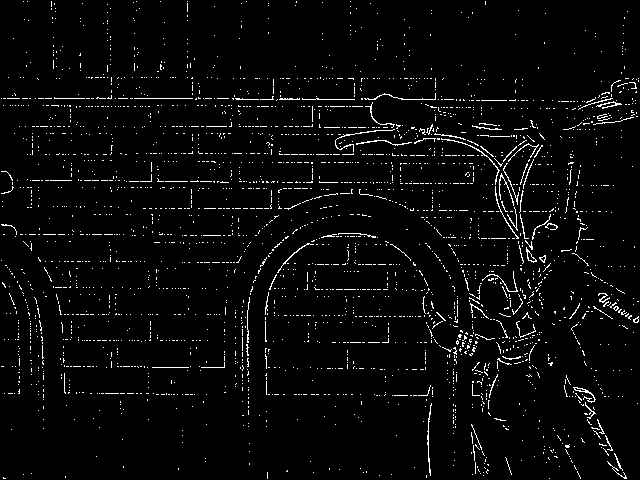
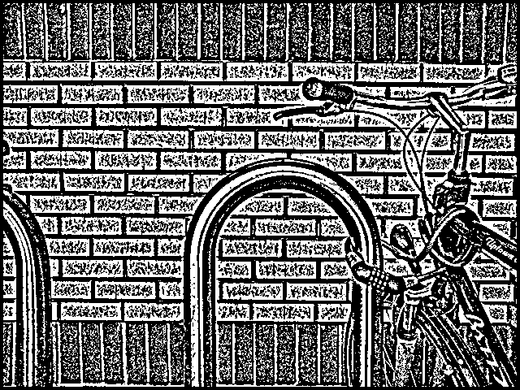
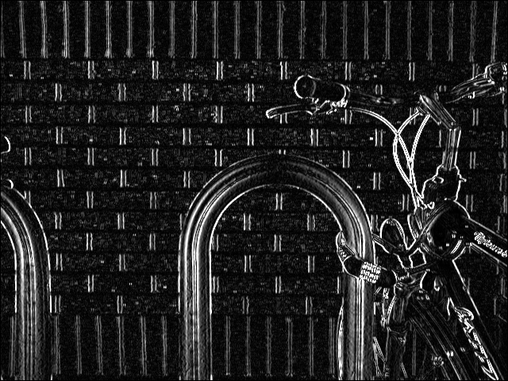
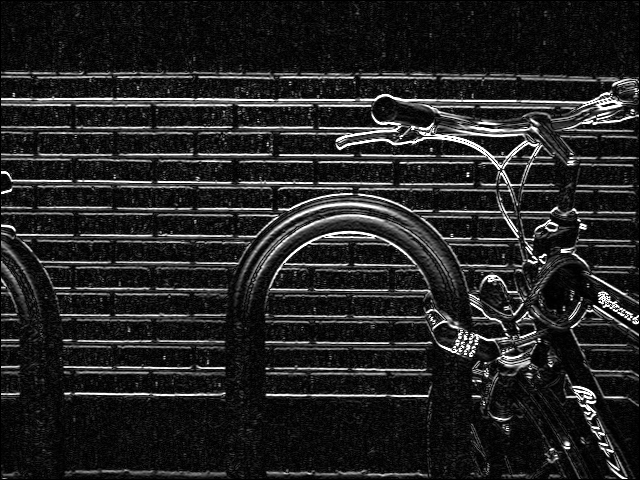

# Hranový detektor
Tento projekt implementuje různé filtry pro detekci hran v obrazech pomocí knihovny OpenCV, včetně Sobelova, Prewittova, Laplaceova, Scharrova a Kirschova operátoru.

## Spuštění v Linuxu

### Požadavky
1. Nainstalujte potřebné nástroje:
    ```sh
    sudo apt install build-essential
    ```

2. Nainstalujte OpenCV:
    ```sh
    sudo apt install libopencv-dev
    ```

### Sestavení
1. Naklonujte tento repozitář:
    ```sh
    git clone https://github.com/mucha006/CSI_projekt
    cd CSI_projekt
    ```
2. Zkompilujte projekt:
    ```sh
    g++ detektor.cpp -o detektor `pkg-config --cflags --libs opencv4`
    ```

### Spuštění programu
1. Po úspěšném sestavení spusťte aplikaci:
    ```sh
    ./detektor
    ```

## Spuštění ve Windows
1. Nainstalujte OpenCV
2. Použijte nějaké vývojové prostředí (např. Visual Studio 2022)

## Přehled programu
Program načte obrázek, aplikuje na něj různé filtry pro detekci hran a výsledky zobrazí. Výsledky jsou prahovány, aby byly zobrazeny pouze hrany.

1. **Načtení obrázku**: Obrázek je načten v odstínech šedi pomocí funkce `imread` z knihovny OpenCV.
2. **Aplikace filtrů**:
    - Každý filtr je implementován jako funkce, která aplikuje konvoluci s příslušným jádrem.
    - Laplaceův filtr podporuje změnu velikosti jádra.
3. **Prahování**: Výsledky filtrů jsou prahovány pomocí funkce `applyThreshold`.
4. **Zobrazení výsledků**: Výsledky jsou zobrazeny pomocí funkce `imshow`.

### Implementované filtry
1. **Sobelův operátor**: Detekuje vertikální a horizontální hrany pomocí gradientových jader.
2. **Prewittův operátor**: Podobný Sobelovu operátoru, ale s jednoduššími jádry, vhodný pro méně zašuměné obrázky.
3. **Laplaceův operátor**: Detekuje hrany pomocí druhé derivace, zvýrazňuje jemné detaily.
4. **Scharrův operátor**: Poskytuje vyšší přesnost detekce hran než Sobelův operátor.
5. **Kirschův operátor**: Detekuje hrany v osmi různých směrech, vhodný pro složité struktury.

### Popis vybraných funkcí
`applyConvolution`: Aplikuje konvoluci na vstupní obraz pomocí zadaného jádra. Umožňuje aplikovat jádro na každý pixel obrazu a jeho okolí, čímž se zvýrazní specifické vlastnosti, jako jsou hrany.

`applyThreshold`: Převádí gradientní obraz na binární obraz, kde jsou hrany jasně odděleny od pozadí. Slouží k zjednodušení obrazu a lepší identifikaci hran. Pokud je hodnota pixelu větší než prah, pixel se vykreslí jako hrana (255), jinak jako pozadí (0).

## Výsledky

### Původní obrázek


### Laplaceův operátor: Velikost jádra 3x3 vs 9x9
- **Jádro 3x3**:  
  Laplaceův operátor s jádrem 3x3 detekuje jemné hrany a detaily v obraze. Je vhodný pro zvýraznění menších změn intenzity pixelů. Výsledkem jsou tenké a přesné hrany, ale může být citlivý na šum.
  
  

- **Jádro 9x9**:  
  S větším jádrem (9x9) Laplaceův operátor detekuje širší oblasti změn intenzity. To vede k silnějším a méně detailním hranám, ale zároveň je méně citlivý na šum. Tato velikost jádra je vhodná pro detekci větších struktur v obraze.

  

### Sobelův operátor: Vertikální vs horizontální hrany
- **Vertikální hrany**:  
  Sobelův operátor pro vertikální hrany používá jádro, které zvýrazňuje změny intenzity podél horizontální osy. To znamená, že detekuje hrany, které jsou svislé.

  

- **Horizontální hrany**:  
  Sobelův operátor pro horizontální hrany používá jádro, které zvýrazňuje změny intenzity podél vertikální osy. Detekuje tedy hrany, které jsou vodorovné.

  

## Porovnání výsledků
- **Laplace 3x3 vs 9x9**: Menší jádro (3x3) detekuje jemnější hrany, zatímco větší jádro (9x9) detekuje širší oblasti změn intenzity.
- **Sobel Vertikální vs Horizontální**: Vertikální jádro detekuje svislé hrany, zatímco horizontální jádro detekuje vodorovné hrany.
- **Prewitt vs Sobel**: Prewitt je méně citlivý na šum, ale poskytuje méně výrazné hrany než Sobel.
- **Scharr**: Poskytuje nejpřesnější detekci hran, ale je výpočetně náročnější.
- **Kirsch**: Detekuje hrany ve všech směrech, což je užitečné pro složité obrazy.


